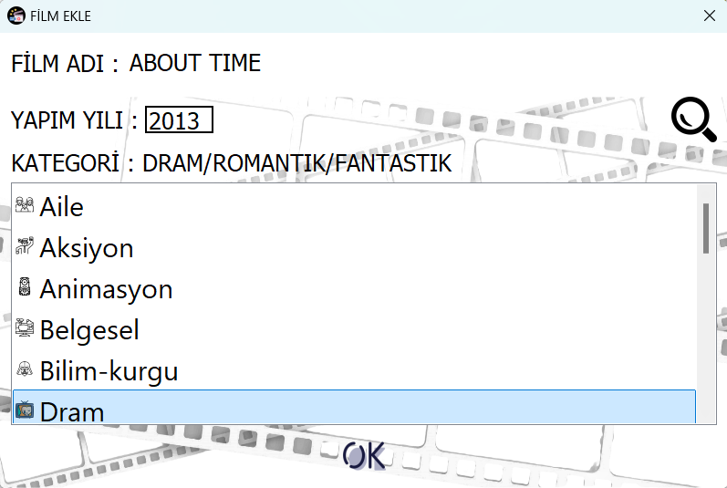
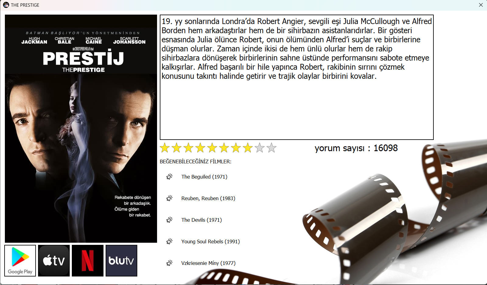
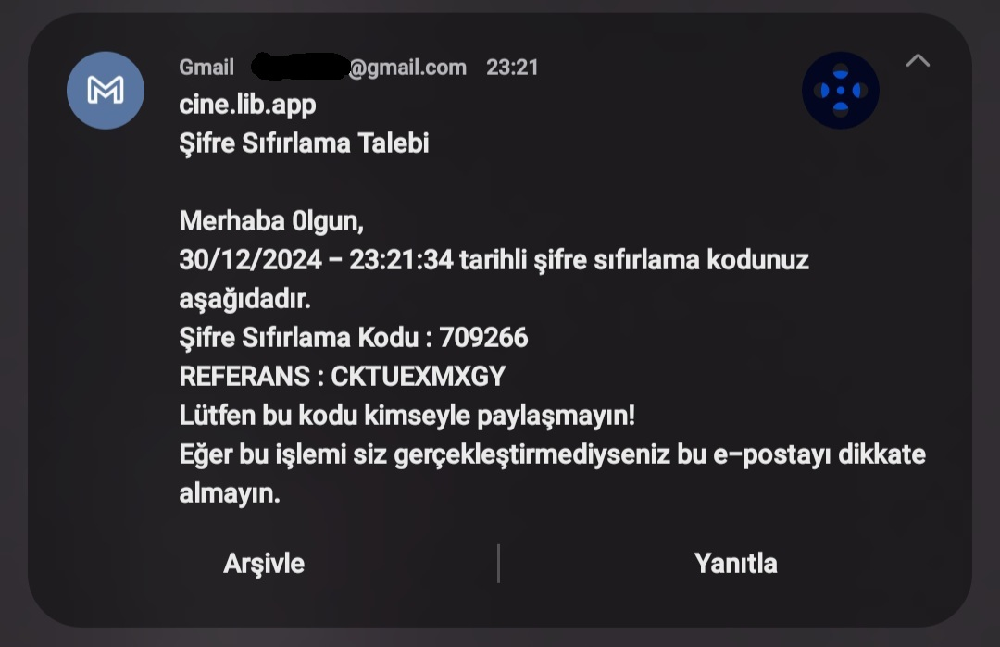
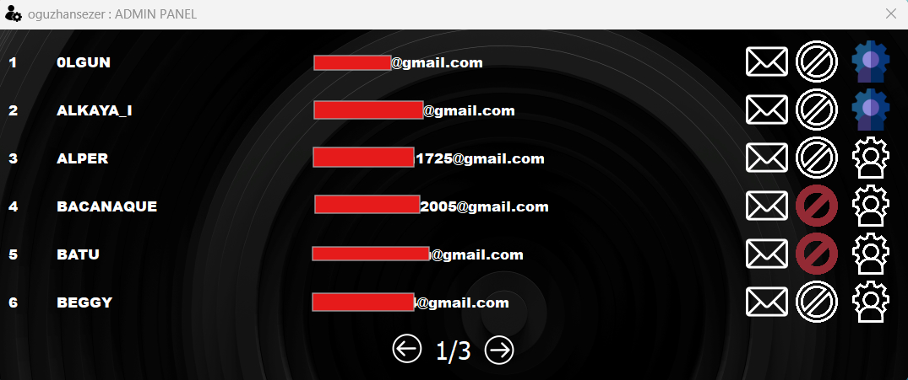
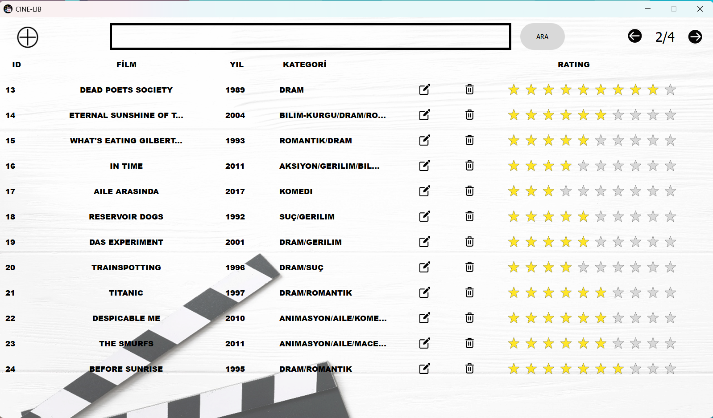
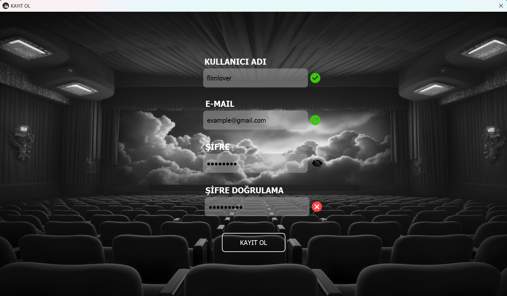
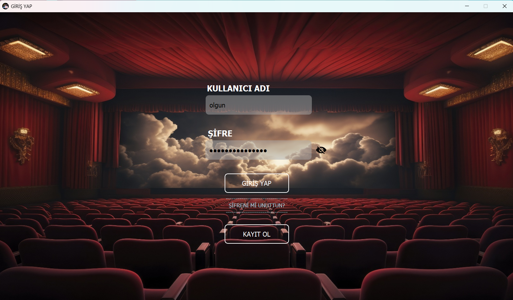

# CineLib - Movie Library Application

CineLib is a desktop application that allows users to manage their movie collections. Thanks to TMDB API integration, it provides access to a rich movie database.

## Features

- **Automatic Movie Information**: Fetch movie details automatically through TMDB API integration
- **Detailed Movie Pages**: Comprehensive information and similar movie recommendations for each film
- **User Management**: Email verification registration system
- **Admin Panel**: User management and system control

## Screenshots

### Add Movie

Automatic information retrieval by entering movie name

### Movie Details

Comprehensive movie information and similar movie recommendations

### Email Verification

Email verification system for secure user registration

### Admin Panel

Management interface for authorized users

### Main Screen

Movie collection display

### User Operations

Registration and login screens

## Technologies

- Python
- PyQt5
- SQLite
- TMDB API
- Gmail API
